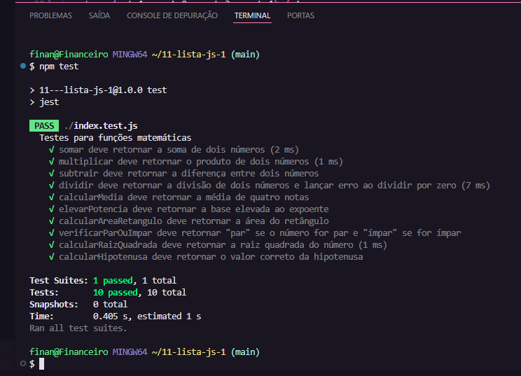

# 🚀 Lista de exercícios Javascript

 ** Bem-vindos à lista de exercícios sobre JavaScript! 🎉 As instruções de cada questão, estão comentadas em seus respectivos arquivos. 💪

- Objetivo: O objetivo desta atividade foi proporcionar uma prática sobre a criação e
utilização de funções em JavaScript. Os exercícios cobrem conceitos fundamentais como
definição de funções, parâmetros, valores de retorno, e o uso de funções em operações
matemáticas.

# Realizações:

** Base da lista: No navegador acesse o seguinte https://github.com/profrafamatos/11-lista-
js-1

* Repositório Clonado conforme instruções.
* Funções foram implementadas.
* Testes concluídos conforme imagem abaixo:

